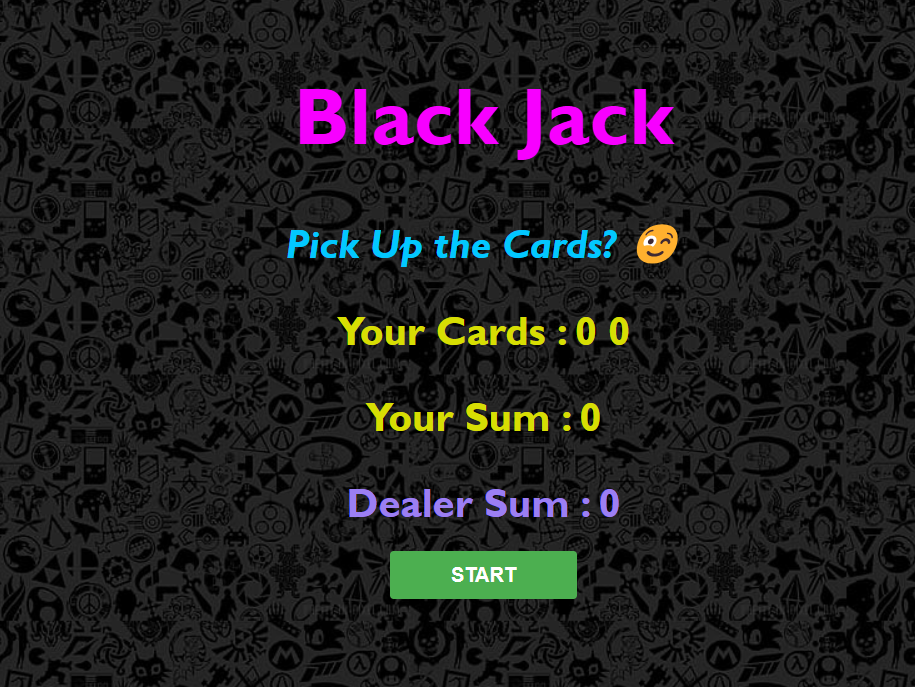
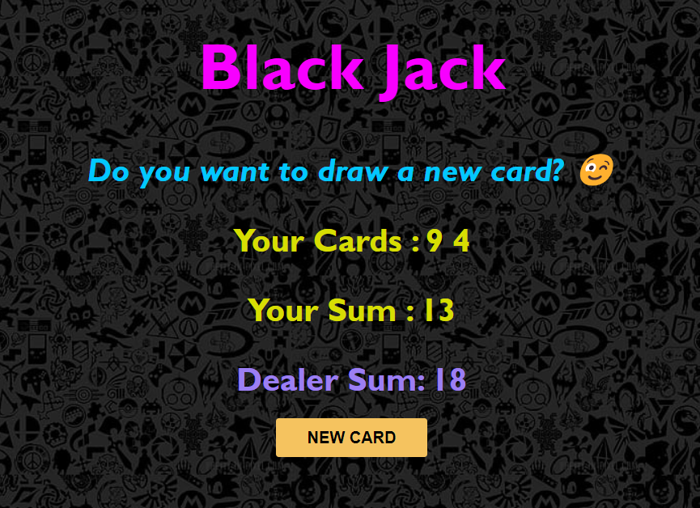
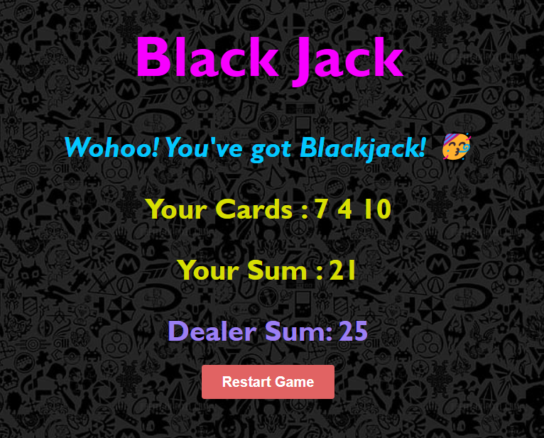
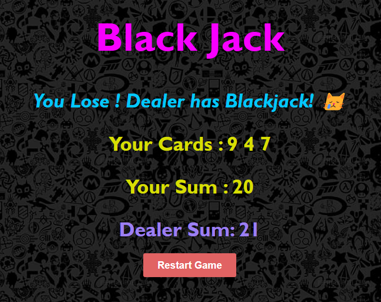

# BlackJack-Game

This is a Blackjack game where the player aims to reach a sum of 21 before the dealer to win. 

This project, developed to practice JavaScript, is an interactive and functional game implemented using HTML, CSS, and JavaScript.

I was practicing JavaScript through it and wasn't planning to add it to GitHub, but the result turned out so good that I couldn't hold it back. 

## About
#

The game is designed to simulate a simple Blackjack game. Players draw cards and try to reach a sum of 21 without exceeding it, while competing against a dealer doing the same.

## Features
#

- **Random Card Drawing**: Cards are drawn with values between 1 and 13.
- **Game State Management**: Tracks and displays player and dealer card sums.
- **Win/Loss Detection**: Determines the game outcome based on Blackjack rules.
- **Interactive UI**: Buttons for starting a new game, drawing new cards, and restarting.

## Files

- `index.html`: Structure and layout of the game interface.
- `index.css`: Styling for the game interface.
- `index.js`: Contains the game logic and functionality.
- `images/`: Folder containing images for the game.

## How to Play  
#
### Method 1 : Online
- You can play the game online by clicking here: [Let's Play](https://pragati-c19.github.io/BlackJack-Game/)

### Method 2 : On local Machine
 - **Clone the repository**:
   ```bash
   git clone https://github.com/Pragati-C19/BlackJack-Game.git
   ```
- Open `index.html` in a web browser.
- **Start the Game :** Click the "Start" button.
- **Draw Cards :** Click the "New Card" button to draw more cards.
- **End Game :** The game determines if you've won or lost and displays a restart button.

### Gameplay Instructions :
   - Click the "Start" button to begin the game.
   - The game will randomly draw two cards for the player and two cards for the dealer.
   - The player's goal is to reach a sum of 21 without exceeding it.
   - Click the "New Card" button to draw a new card for the player.
   - The game will display the player's and dealer's card sums.
   - If the player's sum exceeds 21, they lose the game.
   - If the player's sum is equal to 21, they hit Blackjack! 🃏

## Implementation (Key JavaScript Techniques):
#
1. *Random Card Generation*:
   ```javascript
   function getRandomCard() {
       let randomNumber = Math.floor(Math.random() * 13) + 1;
       if (randomNumber === 1) return 11;
       else if (randomNumber > 10) return 10;
       return randomNumber;
   }
   ```

2. *Game Initialization and State Management*:
   ```javascript
   function startGame() {
       let firstCard = getRandomCard();
       let secondCard = getRandomCard();
       cards = [firstCard, secondCard];
       sum = firstCard + secondCard;
       isAlive = true;
       baseSetup();
   }
   ```

3. *Condition-based Rendering*:
   ```javascript
   function baseSetup() {
       cardEl.textContent = "Cards: " + cards.join(" ");
       sumEl.textContent = "Sum: " + sum;
       if (sum < 21) {
           message = "Do you want to draw a new card? 🙂";
       } else if (sum === 21) {
           message = "Wohoo! You've got Blackjack! 🥳";
           hasBlackJack = true;
           isAlive = false;
       } else {
           message = "You're out of the game! 😭";
           isAlive = false;
       }
       messageEL.textContent = message;
   }
   ```

## Algorithm:

- **Initialize Game**: Setup initial game state.
- **Draw Cards**: Player draws cards until they stand or exceed 21.
- **Dealer's Turn**: Dealer draws cards until reaching at least 17.
- **Determine Outcome**: Compare sums to determine win, loss, or tie.

## Screenshots
#
### 1. Home Page


### 2. Game in Progress - Drawing a New Card


### 3. Win Screen


### 4. Loss Screen


## Contributing

- Contributions are welcome! Please fork this repository and submit pull requests for any enhancements or bug fixes.

## Acknowledgments

- Thanks to online tutorials and resources that aided in the development of this game.

[Play the game online](https://pragati-c19.github.io/BlackJack-Game/)